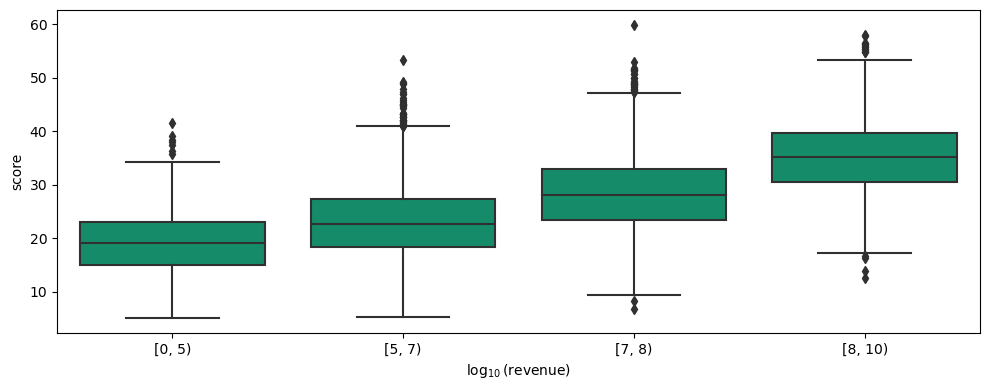
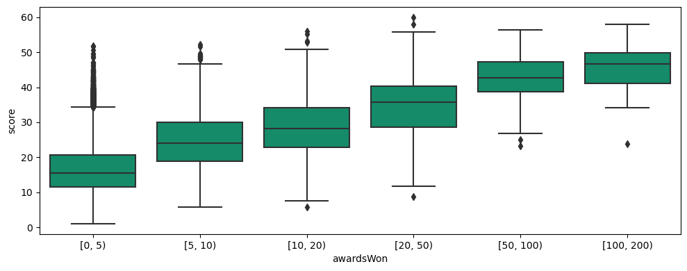
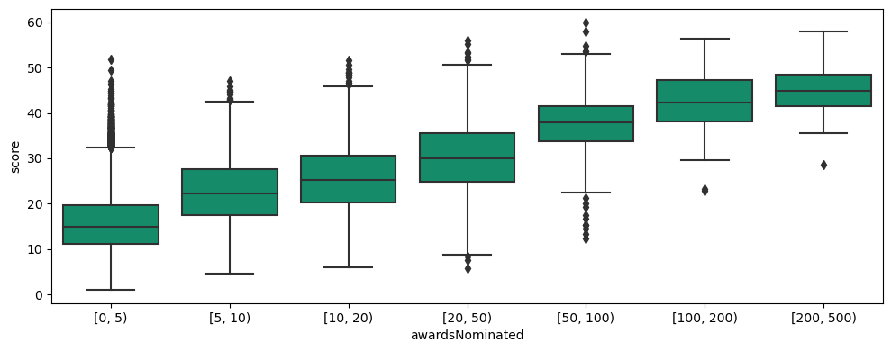

<!-- TODO: Let's refer to this post in the other postes -->

In order to conclude anything about the success of movies or directors in a data-centric approach, first, we need to have a definition about success, and it has to be such that we can measure it with the available data.

We follow a movie-based approach for defining the success of a director, which means that we first need to define a success score for the movies. Having those, we can define several scores to quantify the success of a director based on the scores of the movies that the director has portrayed.

## Success of a movie

Many different measures can determine the success of a movie. Briefly, what matters could be summarized into these four questions:
  - How many people watched the movie?
  - How was the quality of the movie?
  - How impactful was the movie?
  - How much money did the movie make?

For some, maybe the last question suffices to define the success of a movie. However, in this study, we focus more on the popularity and the quality of the movie. Measuring the impact of a movie is possible by for instance analyzing the blogs, posts, and tweets that mentioned the name of the movie. The authors believe that this is a tedious task and out of the scope of this study. The revenue of the movie is available in our datasets but only for 10% of the movies. We argue that the revenue of the movie is somehow reflected in the popularity and the quality of the movie, and we stick with the first two questions in this study in order to be able to analyze a larger dataset.

The answer to the first question is directly reflected in the number of IMDb votes that a movie receives. The more popular the movie, the more people watch it, and the more votes it receives. Similarly, the quality of the movie is reflected in the average rating of the movie, which is again available from the IMDb datasets. We therefore only need to find a suitable way to combine these two measures.

Another measure that we can look at is the number of awards and nominations of a movie, which reflects the answer to all the four questions stated above. However, we believe that relying on the number of awards and nominations of movies will limit us only to a set of award-winning movies and limits having a score for less-known movies. Even though the focus of this study is on successful directors, who have many award-winning movies, we still want to take into account the non-award-winning movies of these directors. However, we can use these data to validate any success metric by looking at the correlation of the metric with the number of awards won or nominated.

We define the success score of a movie as
$$
S_{movie} = {Rating}_{movie} \times \log({Votes}_{movie}),
$$
which reflects both the popularity and the quality of the movie.

### Assessment of the metric

In the following, we show that the suggested score represents the success of a movie well by validating it against the revenue and the awards of the movie.

The above figure shows the distribution of the score with different revenue ranges of the movie. We can see that overall, there is a positive correlation between our score and the logarithm of the revenue of the movie, although this correlation is stronger for higher scores.

The above figures show the distribution of the score with different ranges of number of awards won and nominated. The positive correlation shows that our metric is able to capture well the features which define the success of the movie in terms of its chances for winning awards.

However, we should bear in mind that this method for quantifying the success of a movie favors the movies with larger audiences to a large extent. For seeing this, we can take a look at the overall distribution of the number of IMDb votes and the IMDb rating and compare this for movies produced in different countries or in different decades. In the following figures, we can observe that movies produced in some countries such as Argentina clearly have lower votes than the whole dataset, which will damage their final score. Likewise, the movies produced in the 10s have been watched by less people in the technological era, which is again, reflected by lower number of IMDb votes. This could lead us to favor modern-life directors over the older ones simply because they have had larger audiences. To address this, we should always compare the scores of movies or directors that are produced in the same country and in the same temporal period.

<!-- TODO: Replace by interactive plots ? -->

<!-- TODO: If not, make these one figure. -->

## Success of a director
TODO: Write

## Final remark

TODO: features -> data fit
